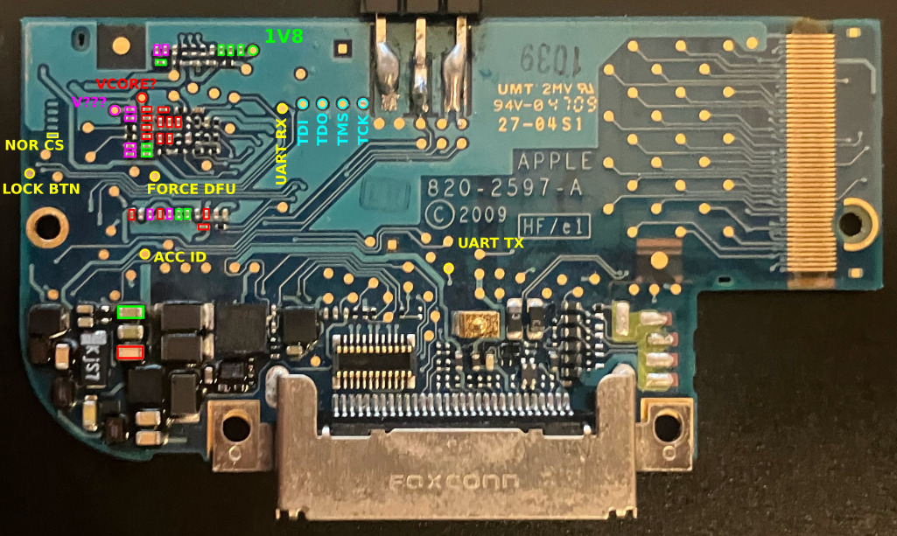

# S5L8720 (iPod Touch 2g) Stuff
A few years ago I set out to extract the GID key from the S5L8720 (aka iPod Touch 2g). I gave up, but I want to resurrect my efforts, with proper notes this time.

S5L8720 background info: https://theapplewiki.com/wiki/S5L8720

What is a GID key? https://theapplewiki.com/wiki/GID_Key (TL;DR an AES-256 key, shared across all devices of the same model)

## Pinouts

Pulling `FORCE_DFU` up to 1v8 forces the device to immediately boot into DFU mode (which is vulnerable to the [steaks4uce exploit](https://github.com/axi0mX/ipwndfu/blob/master/steaks4uce.py) - among others)

It will happily boot into DFU with a bare motherboard with no peripherals or battery, as pictured above.

The `NOR_CS` pad is noteworthy because it's easy to toggle from software. I plan to use this to sync with the AES engine (for DFA or CPA).

## Plan:

I can make the AES engine do stuff, but I'm not entirely sure what it's doing.

We should be able to use the data here as test vectors, since fw keys are derived via GID: https://theapplewiki.com/wiki/Keys:Jasper_8C148_(iPod2,1)

I should parse the img3 and try to decrypt some kbag keys and see if they match the ones in that link.
